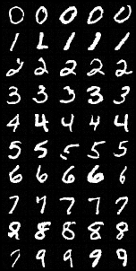

# Stable Diffusion from scratch

## Little intro

It is an educational repository with a purpose to understand how Stable Diffusion and Diffusion models work.

**Why did I decide to create this repo?**<br/>
I started this project with the purpose to understand how Stable Diffusion works and what math it uses. I've read a lot of articles with math explanation and code implementation, but I didn't find something which bridges them in the one place.

**Do you need to have a degree to understand math?**<br/>
It depends on level you have, but I tried to write formulas with all important details and links to resources, which you can read if you get stuck.

## How better to read this repo?

Latent Diffusion models based on Diffusion models(or Simple Diffusion). It's the heart of Stable Diffusion and it's really important to understand what diffusion is, how it works and how it's possible to make any picture in our imagination from just a noise. These are my suggestions about steps to understand the information.

1. Start with [Math Explanation.ipynb](https://github.com/juraam/stable-diffusion-from-scratch/blob/main/Math%20Explanation.ipynb) . This is my explanation of math behind diffusion models, based on great articles of other authors and of course my own research. It took two weeks to understand all details of formulas, but I tried to give the information easily.

2. In this repo you can look at implementation of two different diffusion models: [Conditional Diffusion](https://github.com/juraam/stable-diffusion-from-scratch/tree/main/src/condition_diffusion) and [Simple Diffusion](https://github.com/juraam/stable-diffusion-from-scratch/tree/main/src/diffusion). The Conditional is similar to Stable Diffusion, but it works only number(number means class or digit) input, not text prompts. So it's better to start from Simple Diffusion models.

3. For experiments I have created two jupyter notebooks:
    * For training and sampling [Simple Diffusion](https://github.com/juraam/stable-diffusion-from-scratch/blob/main/Train%20and%20sample%20diffusion.ipynb)
    * For training and sampling [Conditional Diffusion](https://github.com/juraam/stable-diffusion-from-scratch/blob/main/Train%20and%20sample%20conditional%20diffusion.ipynb).

## Code

### INSTALL REQUIREMENTS

To start working with code, please download all required dependencies:

```shell
pip install -r requirements.txt
```

### DOWNLOAD MODELS

I put all models with git lfs, so to get all models, just run:

```shell
git lfs fetch --all
```

### SAMPLING

If you want to get random samples, open [Simple diffusion](https://github.com/juraam/stable-diffusion-from-scratch/blob/main/Train%20and%20sample%20diffusion.ipynb). Or if you want to control a generation with input as class, open [Conditional diffusion](https://github.com/juraam/stable-diffusion-from-scratch/blob/main/Train%20and%20sample%20conditional%20diffusion.ipynb).

All jupyter notebooks have PATH_TO_READY_MODEL, which you should fill to skip the training phase.

### TRAINING

If you want to train a simple diffusion, open [Simple diffusion](https://github.com/juraam/stable-diffusion-from-scratch/blob/main/Train%20and%20sample%20diffusion.ipynb), choose dataset (cifar10 or mnist) and run all cells.

If you want to train a conditional diffusion, open [Conditional diffusion](https://github.com/juraam/stable-diffusion-from-scratch/blob/main/Train%20and%20sample%20conditional%20diffusion.ipynb), choose dataset (cifar10 or mnist) and run all cells.

## Results of my model

| Model              | FID (CIFAR 10) |
| ------------------ | ------------- | 
| Original Diffusion | 3.17          |
| My Diffusion       | 30            |

 

## References

* https://lilianweng.github.io/posts/2021-07-11-diffusion-models/
* https://calvinyluo.com/2022/08/26/diffusion-tutorial.html#mjx-eqn%3Aeq%3A79
* https://arxiv.org/abs/2006.11239
* https://arxiv.org/abs/2207.12598
* https://github.com/TeaPearce/Conditional_Diffusion_MNIST
* https://github.com/cloneofsimo/minDiffusion
* https://theaisummer.com/diffusion-models/
* https://yang-song.net/blog/2021/score/